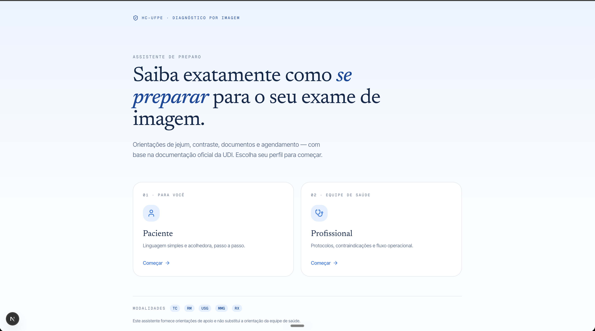
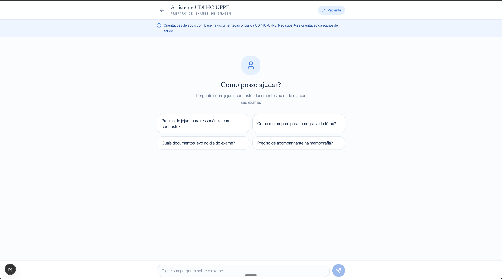

# HC-UFPE Imaging Exam Assistant

An AI-powered assistant that helps patients and healthcare professionals at the **Diagnostic Imaging Unit (UDI)** of **Hospital das Clínicas — UFPE** find out exactly how to prepare for imaging exams (CT, MRI, ultrasound, mammography, X-ray, and more).

The assistant answers questions about fasting, contrast, required documents, scheduling, AGHU codes, and operational flow — grounded **strictly** in the official UDI documentation, never on external or invented medical knowledge.





## Objective

Patients and clinical teams often don't know how to prepare for an imaging exam, which leads to cancellations, repeated visits, and overloaded phone lines at the unit. This project provides a focused conversational assistant that:

- Gives **safe, source-grounded** preparation guidance — it answers *only* with what is written in the official UDI knowledge base, refusing to hallucinate fasting times, dosages, contraindications, or contacts.
- Adapts tone to two profiles:
  - **Patient** — simple, warm, step-by-step language.
  - **Professional** — technical, operational language (protocols, contraindications, request flow, **AGHU codes**).
- Offers a **guided exam picker**: instead of typing, the user drills down by modality → exam → variant (contrast / sedation / side), so it works even when you don't know the exact exam name.
- Handles special cases: the **X-ray request flow** (via AGHU system), the **list of contrast X-ray exams** that require preparation, and a **fallback** when a specific preparation isn't registered yet (it tells the user to contact the sector instead of guessing).
- Keeps **follow-up context**: a question like "and which documents do I bring?" reuses the exam from the recent conversation.
- Always cites the **sources** (exams) used to build each answer.
- **Persists conversations** locally so the user can revisit previous chats.
- Degrades gracefully: if the AI key is missing or the model is unavailable, a **deterministic mock response** built from the same knowledge base is returned, so the app never goes dark.

## How it works

1. The user picks a profile (patient or professional) on the home page.
2. The user types a question **or** walks through the guided picker (modality → exam → variant), which builds the question for them.
3. Each question is normalized and matched against the exam database (`searchExames`) by acronym, name, common name, and synonyms. If the current message doesn't name an exam, recent chat history is used to resolve it.
4. The matched exams, general guidance, contacts, and any special layers (X-ray flow / list) are assembled into a **strict, layered context** prompt.
5. The context plus a profile-specific system prompt (with hard anti-hallucination rules) is sent to Claude.
6. The reply is returned with the cited sources and stored in the browser.

### Knowledge base

The exam catalog is generated from the official spreadsheet (`docs-exames-udi-aghu.md`) by a deterministic ingest script into `data/exames.json`. Preparation guidance lives in `data/preparos.json`.

| Data | Count |
|------|-------|
| Exams (`data/exames.json`) | **814** |
| Preparation entries (`data/preparos.json`) | 14 confirmed (`ok`), 1 partial, 6 pending |

Exams by modality:

| Modality | Exams |
|----------|-------|
| CT (`tomografia_computadorizada`) | 259 |
| X-ray (`radiologia_convencional`) | 212 |
| MRI (`ressonancia_magnetica`) | 193 |
| Ultrasound (`ultrassonografia`) | 108 |
| Nuclear medicine (`medicina_nuclear`) | 32 |
| Mammography (`mamografia`) | 6 |
| Bone densitometry (`densitometria_ossea`) | 4 |

> Every exam carries its **AGHU code** (`sigla`), surfaced only to the professional profile. Only exams with confirmed/partial preparation guidance appear as clickable options in the guided picker.

## Technologies

**Framework & language**
- [Next.js](https://nextjs.org) 16 (App Router)
- [React](https://react.dev) 19
- [TypeScript](https://www.typescriptlang.org) 5.7

**AI**
- [Vercel AI SDK](https://sdk.vercel.ai) (`ai`)
- [`@ai-sdk/anthropic`](https://sdk.vercel.ai/providers/ai-sdk-providers/anthropic) — Claude (`claude-sonnet-4-5`)

**UI & styling**
- [Tailwind CSS](https://tailwindcss.com) 4
- [shadcn/ui](https://ui.shadcn.com) + [@base-ui/react](https://base-ui.com)
- [Lucide React](https://lucide.dev) — icons
- [react-markdown](https://github.com/remarkjs/react-markdown) — render assistant replies
- `class-variance-authority`, `clsx`, `tailwind-merge`, `tw-animate-css`

**Tooling & platform**
- [Playwright](https://playwright.dev) — end-to-end tests (`e2e/`)
- [Vercel Analytics](https://vercel.com/analytics)
- ESLint
- Deployed on [Vercel](https://vercel.com), built/managed with [v0](https://v0.app)

## Project structure

```
app/
  page.tsx                 # Home — profile selection
  chat/
    page.tsx
    chat-client.tsx        # Chat UI (input + guided picker + sidebar)
  api/chat/route.ts        # Chat endpoint: resolve → layered context → Claude (+ fallback)
components/
  guided-exam-picker.tsx   # Modality → exam → variant picker
  chat-sidebar.tsx         # Saved conversations
  ui/                      # shadcn/ui components
hooks/
  use-chat-sessions.ts     # Load/save/select persisted conversations
lib/
  search.ts                # Normalized text search over the exam base
  exam-options.ts          # Modalities & exam options for the picker (+ name prettifying)
  exam-grouping.ts         # Groups exam variants (contrast/sedation/side) for the picker
  chat-storage.ts          # localStorage persistence (7-day TTL, capped, auto-pruned)
  mock-response.ts         # Deterministic fallback when AI is unavailable
  types.ts                 # Shared types
data/
  exames.json              # Exam catalog (generated by ingest)
  preparos.json            # Preparation guidance + general info + X-ray flow
scripts/
  ingest-exames.mjs        # docs-exames-udi-aghu.md → data/exames.json (deterministic)
  verify-grouping.mjs      # Sanity-check variant grouping
e2e/                       # Playwright specs: retrieval, follow-up context, guided picker
docs-exames-udi-aghu.md    # Source spreadsheet (exam catalog + AGHU codes)
```

## Getting Started

Set the Claude API key (optional — without it the app falls back to deterministic responses):

```bash
# .env.local
CLAUDE_API_KEY=your_key_here
```

Run the development server:

```bash
npm run dev
# or pnpm dev / yarn dev
```

Open [http://localhost:3000](http://localhost:3000).

## Scripts

| Script | Description |
|--------|-------------|
| `npm run dev` | Start the dev server |
| `npm run build` | Production build |
| `npm run start` | Run the production build |
| `npm run lint` | Run ESLint |
| `npm run ingest` | Regenerate `data/exames.json` from the source spreadsheet |
| `npm run ingest:check` | Parse + validate + report, without writing |
| `npm run test:e2e` | Run the Playwright end-to-end suite |
| `npm run test:e2e:ui` | Run the E2E suite in Playwright UI mode |

> The E2E suite hits the **real** AI via `/api/chat`, so it needs `CLAUDE_API_KEY` in `.env.local`.

## Disclaimer

This assistant provides **support guidance only** and does **not** replace the orientation of the healthcare team.

---

Built with [v0](https://v0.app). This repository is linked to a [v0 project](https://v0.app/chat/projects/prj_HlYN3UAL7PZ831ukC4wteYW0l12L) — every merge to `main` auto-deploys.
